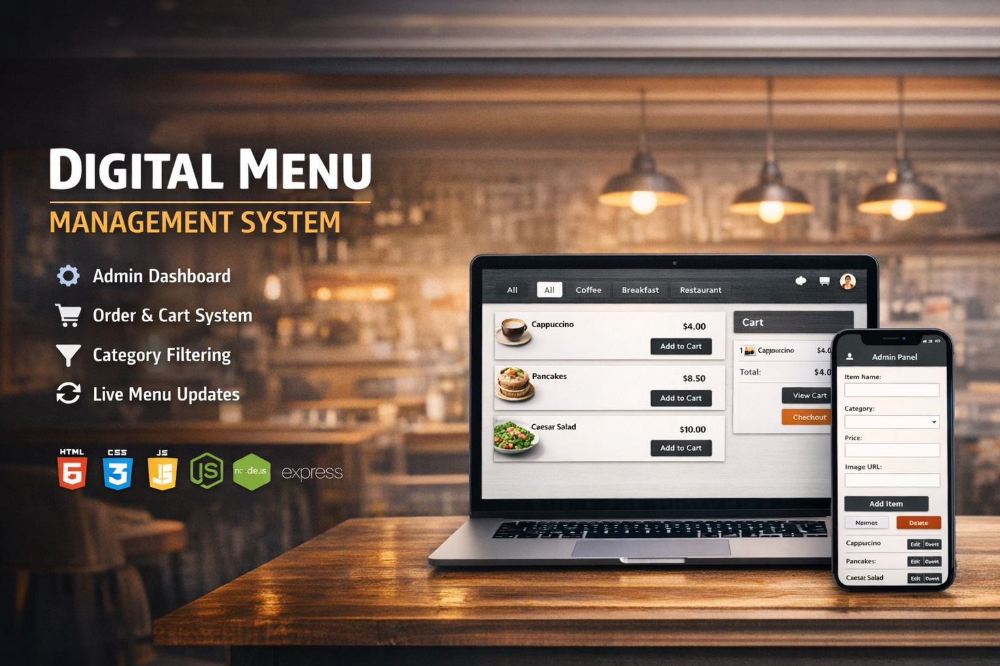
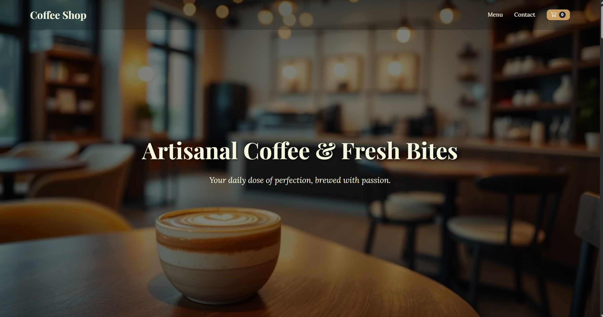
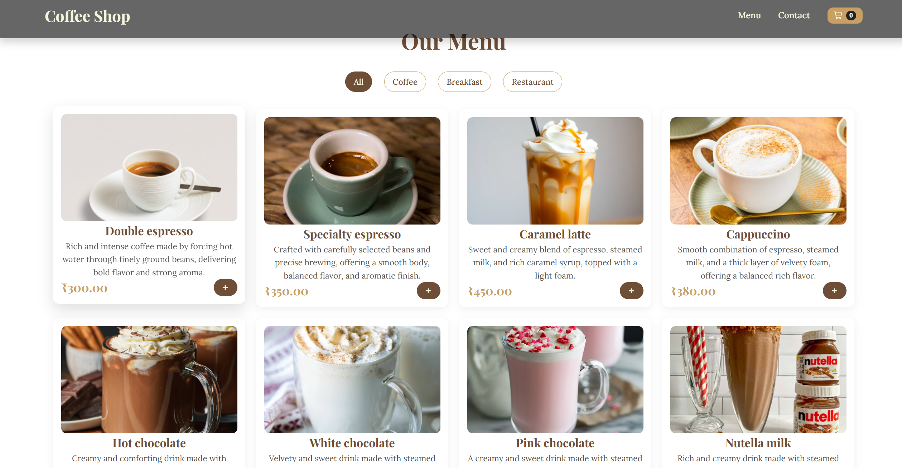
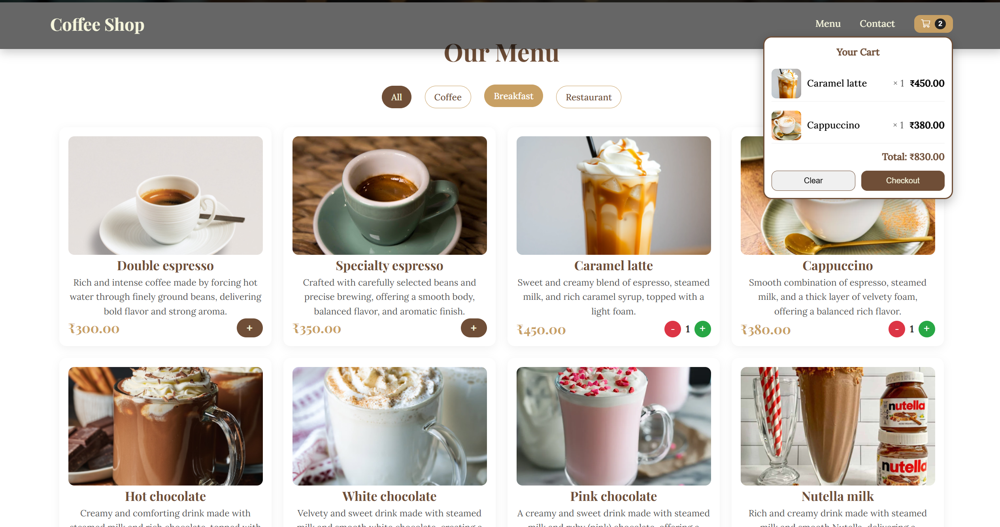
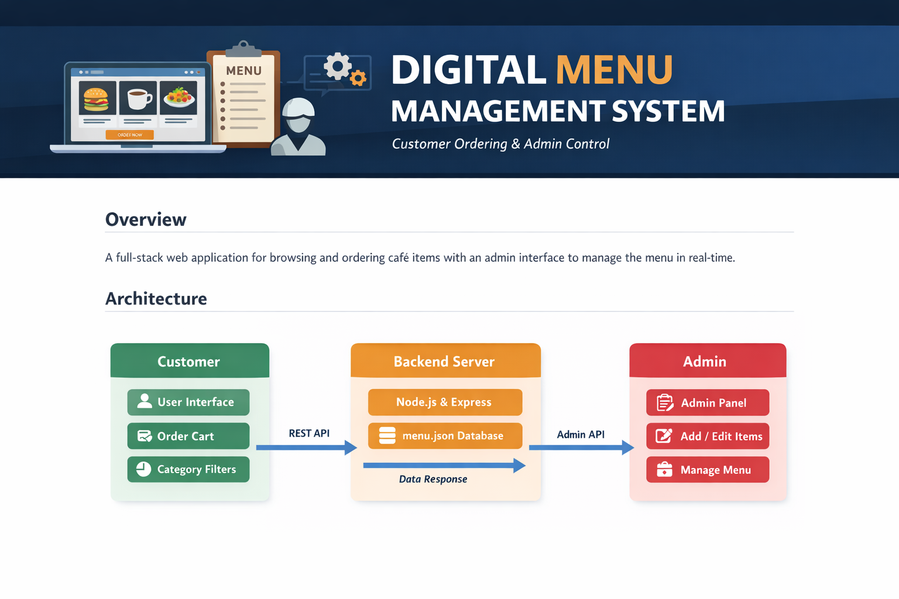

<p align="center">
  
</p>
# Digital Menu Management System

The Digital Menu Management System is a full-stack web application that allows customers to browse café items, filter menu categories, and manage orders while providing an administrative interface for real-time menu management.

The system is built using HTML, CSS, and JavaScript for the frontend, and Node.js with Express.js for the backend. Menu data is stored locally in a JSON file and dynamically updated through the admin panel.

---

## Screenshots

| Interface | Interface | Interface |
|-----------|-----------|-----------|
|  |  |  |

---

## Overview

This project demonstrates a simple yet effective implementation of a digital menu system where customers can explore available food items while administrators can manage menu content without modifying the source code.

The application supports dynamic menu loading, cart functionality, category filtering, and live updates through a backend service.

---

## Key Features

Dynamic Menu Rendering  
Menu items are fetched from `menu.json` and rendered dynamically on the frontend.

Category-Based Filtering  
Users can filter menu items by category such as Coffee, Breakfast, or Restaurant items.

Cart System  
Customers can add items to the cart, view quantities, and track the total order amount.

Admin Management Panel  
Administrators can add, edit, or delete menu items through a dedicated admin interface.

Real-Time Menu Updates  
Changes made by the admin panel update the `menu.json` file and are reflected instantly.

Responsive User Interface  
The layout adapts to desktop, tablet, and mobile screen sizes.

Toast Notifications  
User actions such as adding items to the cart are confirmed through notification messages.

---

## Technology Stack

Frontend

- HTML5
- CSS3
- JavaScript (Vanilla JS)

Backend

- Node.js
- Express.js

Data Storage

- JSON file (`menu.json`)

Server

- Localhost Node.js server

---

## Installation and Setup

### 1. Install Node.js

Download and install Node.js from the official website:

https://nodejs.org/

---

### 2. Install Project Dependencies

Open the project folder in the terminal and run:

```bash
npm install express cors body-parser
```

---

### 3. Start the Backend Server

Run the following command:

```bash
node server.js
```

The server will start at:

```
http://localhost:3000
```

---

### 4. Open the Application

Open the main customer interface:

```
index.html
```

To access the administrative interface:

```
admin.html
```

Using the **Live Server extension in VS Code** is recommended for smoother development.

---

## User Workflow

### Customer Workflow

```
1. Open index.html to view the digital café menu.
2. Use category filters to browse specific types of items.
3. Select "Add to Cart" to include items in the cart.
4. View the cart panel to track item quantities and total price.
```

---

### Administrator Workflow

```
1. Open admin.html to access the admin panel.
2. Add new menu items by providing item details.
3. Edit or remove existing menu entries.
4. Updates are saved directly to menu.json.
5. The customer interface automatically reflects the updated menu.
```

---

## Project Structure

```
cafe-menu-main
│
├── index.html        # Customer-facing menu interface
├── admin.html        # Admin control panel
├── menu.json         # Menu data storage
├── script.js         # Frontend logic for menu and cart
├── admin.js          # Admin CRUD operations
├── server.js         # Express.js backend server
├── style.css         # Application styling
└── README.md         # Project documentation
```

---
<p align="center">
  
</p>

## System Workflow

```
1. The Express backend server reads and writes data from menu.json.
2. The frontend loads menu items dynamically using the fetch() API.
3. The admin panel sends requests to the backend to modify menu data.
4. Updated data is saved to menu.json.
5. The user interface displays the latest menu items automatically.
```

---

## Future Improvements

Possible enhancements for the system include:

- User authentication for administrators
- Database integration (MongoDB or PostgreSQL)
- Order checkout system
- Payment gateway integration
- Deployment to cloud platforms

---

## License

This project is intended for educational and development purposes.

---

## Author

Yuvraj Singh

GitHub Profile  
https://github.com/Yuvraj-025
